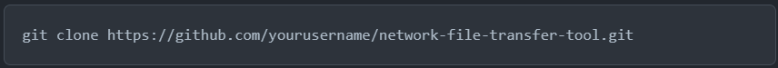
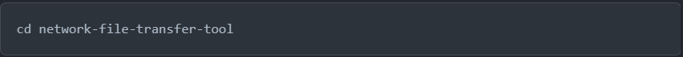
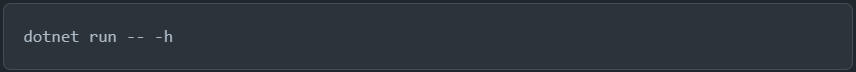

 # Network File Transfer Tool

A simple yet powerful network file transfer tool for seamless sharing of files across devices.

## Table of Contents
+ Features
+ Installation
+ Usage
+ Configuration
+ Security
+ Contributing
+ License 

## Features
- **Cross-Platform Compatibility:** Works on Windows, macOS, and Linux.
- **Fast and Efficient:** Transfer files over the network with high speed and efficiency.
- **Secure:** Utilizes encryption and authentication to ensure secure file transfers.
- **Command-Line Interface (CLI):** Easy-to-use CLI for quick and straightforward operations.
- **Resume Support:** Pause and resume file transfers without losing progress.
- **Multi-Threaded:** Perform multiple file transfers concurrently for improved performance.
- **Detailed Logging:** Keep track of transfer details and errors with comprehensive logs.
  
## Installation
### Prerequisites
+ [.NET Core SDK](https://dotnet.microsoft.com/download)

### Steps
1. Clone the repository:

2. Navigate to the project directory:

3. Build the tool:

3. Run the tool:

## Usage
### Sending Files
> dotnet run -- send -f /path/to/file.txt -t 192.168.1.100

### Receiving Files
> dotnet run -- receive -p 8888

## Configuration
The tool can be configured using a configuration file or command-line options. 

## Security
+ All file transfers are encrypted using [AES-256](https://nvlpubs.nist.gov/nistpubs/fips/nist.fips.197.pdf) encryption.
+ Authentication ensures that only authorized users can send or receive files.
+ For additional security measures, refer to the Security Guide.

## Contributing
Contributions are welcome! Follow these steps to contribute:

1. Fork the repository.
2. Create a new branch: **git checkout -b feature/new-feature.**
3. Make your changes and commit them: **git commit -m 'Add new feature'.**
4. Push to the branch: **git push origin feature/new-feature.**
5. Submit a pull request.
 
## License
This project is licensed under the MIT License - see the LICENSE file for details.
